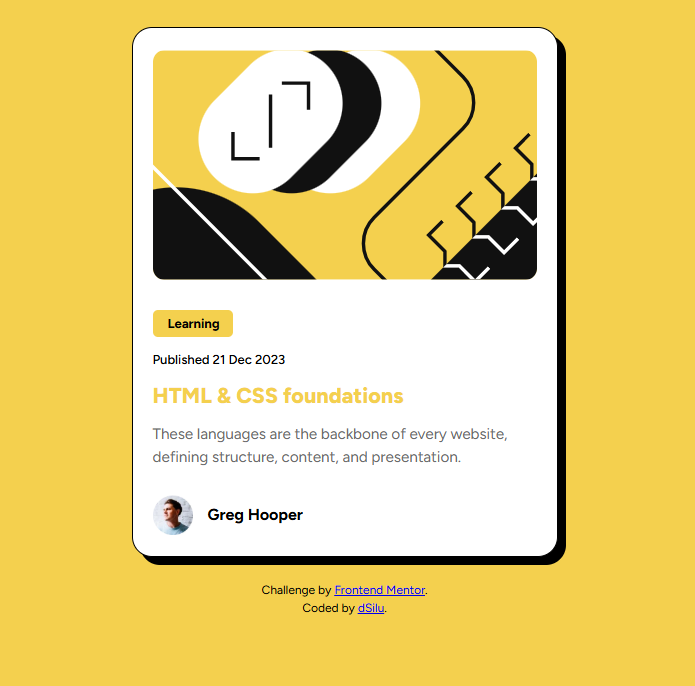

# Frontend Mentor - Blog preview card solution

This is a solution to the [Blog preview card challenge on Frontend Mentor](https://www.frontendmentor.io/challenges/blog-preview-card-ckPaj01IcS). Frontend Mentor challenges help you improve your coding skills by building realistic projects.

## Table of contents

- [Overview](#overview)
  - [The challenge](#the-challenge)
  - [Screenshot](#screenshot)
  - [Links](#links)
- [My process](#my-process)
  - [Built with](#built-with)
  - [What I learned](#what-i-learned)
  - [Continued development](#continued-development)
  - [Useful resources](#useful-resources)
  - [AI Collaboration](#ai-collaboration)
- [Author](#author)
- [Acknowledgments](#acknowledgments)

## Overview

### The challenge

Users should be able to:

- See hover and focus states for all interactive elements on the page

### Screenshot



### Links

- [Solution URL](https://github.com/dSilu/frontend-mentor-worksheet/tree/main/blog-preview-card-main)
- [Live Site URL](https://blog-preview-card-dsilu.netlify.app)

## My process

### Built with

- Semantic HTML5 markup
- CSS custom properties & typography
- Flexbox layout
- Custom local fonts (`@font-face` with variable TTF)
- Mobile-first workflow
- Neo-brutalist styling (hard shadows and border styling)

### What I learned

During this challenge, I reinforced several key CSS fundamentals:

1. **Local Variable Fonts with `@font-face`**:
   Loading variable TTF fonts locally to support a full range of weights (`300` to `900`) efficiently:

   ```css
   @font-face {
     font-family: 'Figtree';
     src: url('./assets/fonts/Figtree-VariableFont_wght.ttf') format('truetype');
     font-weight: 300 900;
     font-style: normal;
     font-display: swap;
   }
   ```

2. **Neo-brutalism Hard Shadows**:
    Achieving the clean, non-blurred card shadow by pairing a solid outline border with a zero-blur box-shadow:

    ```CSS
    .course-card {
    border: 1px solid #111111;
    border-radius: 20px;
    box-shadow: 8px 8px 0px #000000;
    }
    ```

3. **Interactive States & Typography Hierarchy**:
    Fine-tuning line-height and margin spacing to ensure readability and adding smooth hover transitions to the title:

    ```CSS
    #course-card h2 {
    color: #111111;
    transition: color 0.2s ease;
    cursor: pointer;
    }

    #course-card h2:hover,
    #course-card h2:focus {
    color: hsl(47, 88%, 63%);
    }
    ```


### Continued development

Explore more advanced neo-brutalism micro-interactions (e.g., active click states that translate the card into its shadow).

Deepen understanding of CSS fluid typography using clamp() for responsive text scaling across various screen resolutions.

### Useful resources

- [MDN Web Docs - `@font-face`](https://developer.mozilla.org/en-US/docs/Web/CSS/Reference/At-rules/@font-face) - Helped understand how to configure and import local variable font files properly.
- [MDN Web Docs - `box-shadow`](https://developer.mozilla.org/en-US/docs/Web/CSS/Reference/Properties/box-shadow) - Clear explanation of shadow offsets, blur radius, and spread.

### AI Collaboration

Used Gemini to troubleshoot and compare border/shadow visual bugs (specifically fixing the corner detachment with hard box-shadow values).

Leveraged AI guidance to properly configure the @font-face syntax for variable fonts and refine heading/paragraph spacing hierarchies.


### Author

Frontend Mentor - [@dSilu](https://www.frontendmentor.io/profile/dSilu)


### Acknowledgments
Thanks to the Frontend Mentor community for providing practical, design-accurate challenges to hone frontend fundamentals.